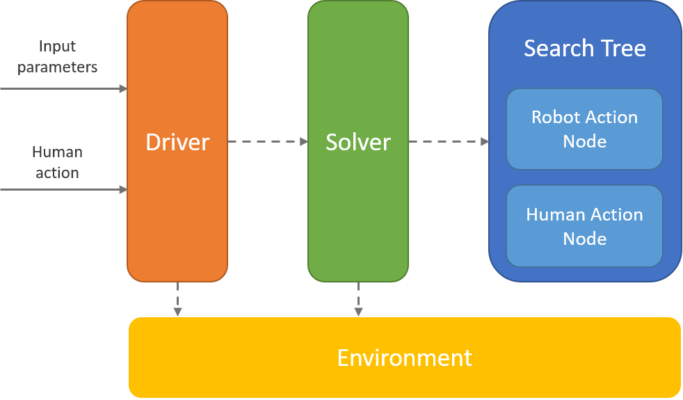

# TICC-MCP

## Table of Contents
- [Setup](#setup)
- [Instructions for basic execution](#instructions-for-basic-execution)
- [Instructions for reproducing simulation experiment results](#instructions-for-reproducing-simulation-experiment-results)
- [Experimental setups](#experimental-setups)
- [Developer Guide](#developer-guide)
- [Support](#support)

## Setup

You will need to install [`PyPy3`](https://pypy.org/download.html).

## Instructions for basic execution

To execute TICC-MCP solver, run
```
pypy3 driver.py <seed>
```

To execute POMCP solver without capability models, run
```
pypy3 'standard POMCP/driver.py' <seed>
```

## Instructions for reproducing simulation experiment results

To reproduce experimental results for TICC-MCP solver, run
```
bash job_launcher.sh
```

To reproduce experimental results for POMCP solver without capability models, run
```
bash std_job_launcher.sh
```

Redirect `sys.stdout` to write output to log files.

## Experimental setups
 The experimental setups can be adjusted in `drive.py`.

### Setup 1 - Varying number of samples
In this setup, the number of shopping lists is fixed at 10 and number of shopping item types is fixed at 5. The number of search samples is varied from 5000 to 50000. Vary `num_iter` in `driver.py` based on number of search samples. 

The shopping lists and the actual capabilities setup are as follows:

_Shopping lists_

Item 1 | Item 2 | Item 3 | Item 4 | Item 5
--- | --- | --- | --- | ---
4 | 3 | 0 | 2 | 3 
1 | 4 | 0 | 7 | 1 
2 | 3 | 2 | 3 | 3 
5 | 4 | 2 | 0 | 2 
0 | 3 | 3 | 4 | 3 
3 | 3 | 0 | 3 | 3 
6 | 3 | 0 | 1 | 2 
2 | 3 | 4 | 1 | 2 
1 | 1 | 2 | 4 | 4 
0 | 3 | 2 | 5 | 2

_Human's capability_

Item 1 | Item 2 | Item 3 | Item 4 | Item 5
--- | --- | --- | --- | ---
0\% | 100\% | 10\% | 0\% | 100\%

_Robot's capability_

Item 1 | Item 2 | Item 3 | Item 4 | Item 5
--- | --- | --- | --- | ---
100\% | 0\% | 100\% | 100\% | 10\% 


### Setup 2 - Varying number of shopping item types
In this setup, the number of shopping lists is fixed at 2 and number of search samples is fixed at 50000. The number of shopping item types is varied from 2 to 5. Vary `reward_space` in `driver.py` accordingly.

The shopping lists and the actual capabilities setup are as follows:

#### Two item types

_Shopping lists_

Item 1 | Item 2 
--- | --- 
1 | 12
2 | 10

_Human's capability_

Item 1 | Item 2 
--- | --- 
50\% | 100\%

_Robot's capability_

Item 1 | Item 2 
--- | --- 
100\% | 50\%

#### Three item types

_Shopping lists_

Item 1 | Item 2 | Item 3 
--- | --- | --- 
8 | 5 | 0
2 | 5 | 6

_Human's capability_

Item 1 | Item 2 | Item 3 
--- | --- | --- 
0\% | 100\% | 10\%

_Robot's capability_

Item 1 | Item 2 | Item 3 
--- | --- | --- 
100\% | 0\% | 100\%

#### Four item types

_Shopping lists_

Item 1 | Item 2 | Item 3 | Item 4
--- | --- | --- | ---
4 | 4 | 2 | 3
3 | 5 | 0 | 5

_Human's capability_

Item 1 | Item 2 | Item 3 | Item 4
--- | --- | --- | --- 
0\% | 100\% | 10\% | 100\%

_Robot's capability_

Item 1 | Item 2 | Item 3 | Item 4
--- | --- | --- | --- 
100\% | 0\% | 100\% | 10\%

#### Five item types

_Shopping lists_

Item 1 | Item 2 | Item 3 | Item 4 | Item 5
--- | --- | --- | --- | ---
2 | 3 | 2 | 3 | 3
5 | 4 | 2 | 0 | 2

_Human's capability_

Item 1 | Item 2 | Item 3 | Item 4 | Item 5
--- | --- | --- | --- | ---
0\% | 100\% | 10\% | 0\% | 100\% 

_Robot's capability_

Item 1 | Item 2 | Item 3 | Item 4 | Item 5
--- | --- | --- | --- | ---
100\% | 0\% | 100\% | 100\% | 10\%

### Setup 3 - Varying number of shopping lists
In this setup, the number of shopping items is fixed at 5 and number of search samples is fixed at 50000. The number of shopping lists is varied from 5 to 10. 

For an n-shopping list setup, use the first n shopping lists used for Setup 1. Vary `reward_space` in `driver.py` accordingly. The actual capabilities setup is also the same as Setup 1.

## Developer Guide
The main solver program is located at the root level. It is modularized into several main components:

* **Driver**: The driver coordinates the functions of the other components. It first takes in input parameters and sets up the TICC-POMDP environment and the TICC-MCP solver. It then executes the solver. After every robot action, the driver takes in a human action input from either an actual human or a simulated human. It is also responsible in returning the intermediate and final results.
* **Solver**: The solver implements the TICC-MCP algorithm. It is responsible for executing the search, as well as building and maintaining the search tree.
* **Search Tree**: The search tree comprises two types of nodes: 1) Robot action node which represents an action taken by the robot 2) Human action node which represents an action taken by the human. It keeps track of the necessary statistics and stores the tree structure.
* **Environment**: The environment contains the TICC-POMDP model in which the robot and human operate. It has all the essential physics and information of the world.

The high level architecture is as follows:

<center>
    
<center>

A similar implementation is done for the standard POMCP algorithm without capability models which can be found under `/standard POMCP`. To ensure the correctness of the program, there are unit tests for all testable atomic functions which can found under `/tests`.

_For better efficiency, the sparse capability model representation can be reduced a flatten list of important entries (two entries for each action)._

## Support
For further questions, reach out to me at [joshualeekaisheng@gmail.com](joshualeekaisheng@gmail.com).
